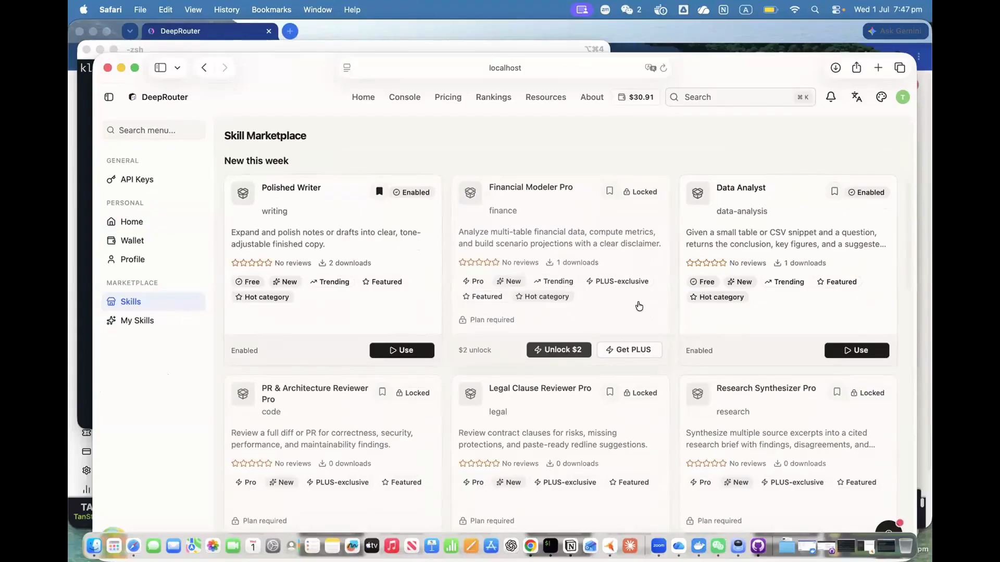

<div align="center">


# DeepRouter

**An OpenAI-compatible, policy-aware LLM gateway for multi-provider routing, tenant controls, and safer AI products.**

[中文说明](./README.zh-CN.md) · [Architecture](./ARCHITECTURE.md) · [Local Development](./DEV.md) · [Project Plan](./PLAN.md)

</div>

## Product Demo

[](https://www.youtube.com/watch?v=9PlYZl8BpE0&t=160s)

Watch the product walkthrough: [DeepRouter — Intelligent LLM Routing Platform with Skills Marketplace](https://www.youtube.com/watch?v=9PlYZl8BpE0&t=160s).

The demo shows how DeepRouter works as an intelligent LLM routing platform and OpenRouter alternative: one gateway for OpenAI, Anthropic, Gemini, DeepSeek, and other major providers, with model selection that balances cost, latency, performance, fallback handling, and operational visibility. It also introduces the Skills Marketplace direction, where developers can publish, discover, and monetize reusable AI skills that run on top of DeepRouter's routing layer.

---

## Why This Project Exists

DeepRouter is a production-oriented fork of [QuantumNous/new-api](https://github.com/QuantumNous/new-api). The upstream project provides a strong OpenAI-compatible AI gateway, admin console, quota system, provider adapters, and model/channel management.

This fork turns that foundation into a more opinionated gateway for products that need:

- one `/v1` API surface across multiple model providers
- tenant-specific policy enforcement
- safer defaults for products serving children or schools
- smart model selection through a sidecar router
- per-request billing hooks and usage accounting
- a codebase that can still pull upstream improvements without losing fork-specific work

The main engineering challenge is not just proxying requests. It is deciding, for every request, which model should serve it, which provider key should be used, which safety policy applies, how metadata should be transformed, and how usage should be accounted for without adding latency or making upstream rebases painful.

## What I Built On Top Of Upstream

DeepRouter keeps the upstream `new-api` gateway intact where possible and adds fork-specific behavior in intentionally isolated modules.

| Area | What changed |
|---|---|
| Tenant policy engine | Added `internal/policy`, a pure decision layer that converts `kids_mode` and `policy_profile` into enforceable per-request flags. |
| Child-safe request enforcement | Added `internal/kids` and `relay/airbotix_policy.go` to enforce model whitelists, metadata stripping, zero-data-retention, and child-safe system prompts. |
| Smart model routing | Added `middleware/smart_router.go` and `internal/smart_router_client` so `deeprouter-auto` requests can be resolved by a routing sidecar before normal channel selection. |
| Multi-tenant user model | Extended the upstream `User` model with `kids_mode`, `policy_profile`, `billing_webhook_url`, `custom_pricing_id`, and `webhook_secret`. |
| Billing architecture | Added `internal/billing`, an HMAC-signed webhook dispatcher with retry behavior for downstream product billing. |
| Skill Marketplace | Added `internal/skill` and `router/skill-router.go` — a curated AI Skill marketplace with tiered monetization, entitlement-gated downloads, consent-gated telemetry, analytics, and admin publishing workflow, plus the `web/default` marketplace/admin/analytics frontends. |
| Request-shape coverage | Wired policy enforcement into OpenAI, Claude Messages, Gemini, and OpenAI Responses request shapes. |
| Engineering documentation | Added architecture, deployment, workflow, coverage, and fork-specific documents for maintainability and onboarding. |

## Core Capabilities

### OpenAI-Compatible Gateway

DeepRouter exposes OpenAI-compatible endpoints while routing to different upstream providers and protocols. Client applications can keep a stable API shape while the gateway handles provider-specific conversion, authentication, retries, streaming responses, and usage accounting.

Supported request families include:

- Chat Completions
- OpenAI Responses
- Anthropic Claude Messages
- Google Gemini-style requests
- Embeddings
- Images
- Audio
- Rerank
- Realtime and streaming paths
- Async generation task paths such as image/video style providers inherited from upstream

### Two-Layer Routing

DeepRouter separates "which model should handle this?" from "which provider channel should serve that model?"

```text
Client request
  model: deeprouter-auto
        |
        v
Layer 1: smart-router sidecar chooses a concrete model
        |
        v
Layer 2: new-api channel cache chooses a healthy provider key
        |
        v
Relay handler converts the request and calls the upstream provider
```

This preserves upstream channel routing while allowing a separate model-selection service to evolve independently.

### Tenant-Aware Policy Controls

Each tenant can carry policy metadata on the user record:

- `kids_mode`
- `policy_profile`
- `billing_webhook_url`
- `custom_pricing_id`
- `webhook_secret`

`internal/policy` turns those settings into a small decision object. Relay code then consumes that decision without duplicating policy branching across handlers.

Current policy decisions include:

- enforce a model whitelist
- force zero-data-retention for supported OpenAI-compatible providers
- remove child or family identifiers from outgoing request metadata
- inject or replace the system prompt with a child-safe instruction set

### Kids Mode

`kids_mode` is a hard-constraint mode for tenants serving under-18 users. When enabled, DeepRouter applies protections before a request reaches the provider adapter:

1. Reject models outside the approved whitelist.
2. Strip identifying metadata such as `user`, `kid_profile_id`, `family_id`, and related fields.
3. Force `store: false` for OpenAI and Azure OpenAI-style requests.
4. Inject a child-safe system prompt across supported request shapes.

The implementation is deliberately small and testable:

- `internal/kids` contains pure transformation helpers.
- `internal/policy` decides whether constraints apply.
- `relay/airbotix_policy.go` applies the constraints before provider conversion.
- `docs/kids-coverage-matrix.md` maps each requirement to tests.

### Billing And Usage Architecture

DeepRouter keeps the upstream quota and usage accounting model, then adds a downstream billing hook for product-specific ledgers.

`internal/billing` provides:

- per-request event payloads
- HMAC-SHA256 signatures
- retry behavior for transient failures
- permanent-failure handling for non-retryable responses
- a non-blocking design intended for relay completion paths

The dispatcher is implemented and tested. Full relay completion wiring is tracked in the project plan so the README does not overstate runtime behavior.

### Skill Marketplace

The Skill Marketplace is the product layer on top of the gateway: an officially curated catalog of AI Skills that users browse, unlock, run in the Playground, or download for a local runner. A "Skill" is a server-managed instruction template plus its entitlement, pricing, safety, and execution configuration, published through a versioned Super Admin workflow. It ships official curated Skills only (user uploads and creator revenue-share come later); the marketplace is the content and retention layer that gives DeepRouter subscriptions ongoing value. It started as a Sprint-ready PRD set under [docs/skill-marketplace/](./docs/skill-marketplace/) and is now implemented end-to-end.

The shipped product loop:

```text
Super Admin authors a Skill, iterates versions, activates and publishes
  -> user browses /skills with social proof (ratings, download counts,
     New / Trending / Popular / PLUS / Kids badges) and leaderboards
  -> user unlocks it: free, plan-included, USD 2 one-time purchase, or PLUS-exclusive
  -> user runs it in the Playground or downloads the Skill package for a local runner
  -> Relay re-checks entitlement, lifecycle, and Kids safety at execution time
  -> usage, billing attribution, analytics, and audit events are recorded
  -> Operations monitors adoption, funnels, category demand, and revenue
```

What is implemented:

- **Marketplace storefront.** Browse, search, and category filters at `/skills`, with detail pages, save/bookmark, star ratings with reviews, reporting, download leaderboards, co-download recommendations, and event attribution for every impression, detail view, save, download, and purchase. My Skills (`/skills/my`) and Saved Skills (`/skills/saved`) track each user's library. Seeded with free demo Skills (Polished Writer, Faithful Translator, Code Helper, Data Analyst) and Pro-gated paid Skills.
- **Tiered monetization.** A shared entitlement matrix covers `free`, `plan_included`, `one_time` (USD 2 permanent unlock), and `plus_exclusive` Skills, with a paywall upsell UI (`Unlock $2` vs `Get PLUS`), purchase orders, and referral-reward integration where a first Skill purchase can trigger two-sided rewards without ever rolling back the purchase.
- **Use-time entitlement.** Unlocking a Skill is not permanent authorization. The relay path (`internal/skill/relay`) re-resolves plan, subscription, one-time entitlement, lifecycle, and Kids state on every execution and maps failures to stable error codes (`SKILL_PLAN_REQUIRED`, `SKILL_KIDS_MODE_BLOCKED`, …); blocked attempts are recorded as auditable usage events.
- **Personalized user surfaces.** A User Home (`/home`) aggregates wallet balance, subscription, purchases, saved Skills, and personalized recommendations; a My Skills page tracks unlocked and saved Skills.
- **Skill packages and runner telemetry.** Entitlement-gated downloads ship a Claude Code-compatible zip (`SKILL.md` entry point, `manifest.json`, instruction template, optional scripts/references) plus a bundled runner, so users can drop a Skill into `.claude/skills/` and use it with the tools they already have. Runner usage reports back through `POST /api/v1/telemetry/skill-usage`, gated server-side by explicit per-user telemetry consent; payloads containing prompts or raw provider data are rejected and never persisted.
- **Privacy-by-default analytics.** Usage analytics are aggregate-only with no prompt text or raw user input; Kids usage is pseudonymized. The Super Admin per-user drill-down (`GET /api/v1/admin/users/:user_id/skill-usage`) is consent-gated, audited on every access, and never returns raw payloads. Users control their own Tier 2 telemetry consent from Profile → Privacy; admins cannot enable it on their behalf.
- **Operations and growth.** A Skill Analytics dashboard (`/skill-analytics`) reports adoption, conversion funnels, category demand, and monetization-linked funnels (recharge → first Skill use, Skill use → repeat recharge); a notification backend sends opt-in weekly Top-Skills digests and re-engagement nudges.
- **Admin tooling.** Super Admin CRUD for Skills and versions with an activate/publish lifecycle, per-skill audit log (template changes audited via `sha256` hash, never prompt text), and monetization controls.

Where it lives:

| Layer | Location |
|---|---|
| Backend domain | `internal/skill/` — handler, model, relay, pricing, tiers, availability, analytics, enums, errcodes, notify, packageassets, seed |
| Routes | `router/skill-router.go` — marketplace, my-skills, download, telemetry, admin, and ops route groups |
| Frontend | `web/default/src/features/marketplace/`, `user-home/`, `skill-analytics/`, `admin-skills/`, plus Playground and Pricing integration |
| Design source of truth | [docs/skill-marketplace/](./docs/skill-marketplace/) — modular PRD set (functional, UX, data/API contract, analytics, security/NFR, M00–M15 work breakdown) |

## Architecture At A Glance

```text
router/
  registers admin, dashboard, and /v1 relay routes

middleware/
  authenticates users, applies rate limits, resolves deeprouter-auto,
  and selects provider channels

controller/
  owns HTTP handlers, admin APIs, user/channel/token/log operations

relay/
  converts request shapes, applies DeepRouter policy, calls provider adapters,
  streams responses, and reports usage

relay/channel/
  provider-specific adapters inherited from and extended around upstream new-api

internal/
  DeepRouter-specific packages kept small and isolated for easier upstream sync

model/
  GORM data models, migrations, channel cache, users, tokens, logs, quota,
  subscriptions, and provider/channel state
```

For a deeper module tour, see [ARCHITECTURE.md](./ARCHITECTURE.md).

## Repository Map

| Path | Purpose |
|---|---|
| `ARCHITECTURE.md` | High-level backend module tour. |
| `AIRBOTIX.md` | Fork-specific intent, status, and rebase-safe zones. |
| `DEV.md` | Local development guide. |
| `PLAN.md` | Phase-by-phase delivery plan and acceptance criteria. |
| `internal/kids/` | Child-safety helper package. |
| `internal/policy/` | Tenant policy decision engine. |
| `internal/billing/` | Signed billing webhook dispatcher. |
| `internal/smart_router_client/` | HTTP client and circuit breaker for the smart-router sidecar. |
| `relay/` | Core LLM relay subsystem. |
| `relay/airbotix_policy.go` | DeepRouter policy application point near provider conversion. |
| `middleware/smart_router.go` | Virtual-model resolution for `deeprouter-auto`. |
| `internal/skill/` | Skill Marketplace backend domain: handlers, models, pricing/tiers, relay entitlement, analytics, telemetry, notifications, seeds. |
| `router/skill-router.go` | Skill Marketplace route groups: marketplace, my-skills, download, telemetry, admin, ops. |
| `docs/kids-coverage-matrix.md` | Traceability matrix for kids-mode enforcement and tests. |
| `docs/skill-marketplace/` | Modular PRD set for the Skill Marketplace (functional, UX, data/API, analytics, security/NFR, WBS, compliance) — the design source of truth behind the implementation. |

## Local Quickstart

### Run The Gateway

```bash
git clone https://github.com/deeprouter-ai/deeprouter.git
cd deeprouter
docker compose up -d
```

Open `http://localhost:3000`, register the first account, and configure a provider channel from the admin UI.

### Send A Test Request

```bash
TOKEN=sk-your-deeprouter-token

curl http://localhost:3000/v1/chat/completions \
  -H "Authorization: Bearer $TOKEN" \
  -H "Content-Type: application/json" \
  -d '{
    "model": "gpt-4o-mini",
    "messages": [
      {"role": "user", "content": "Say hello in five words."}
    ]
  }'
```

### Run With The Smart Router Sidecar

```bash
export DEEPROUTER_INTERNAL_TOKEN=$(openssl rand -hex 32)
docker compose -f docker-compose.smart-router.yml up -d --build
```

Then send a request with the virtual model:

```bash
curl -i http://localhost:3000/v1/chat/completions \
  -H "Authorization: Bearer $TOKEN" \
  -H "Content-Type: application/json" \
  -d '{
    "model": "deeprouter-auto",
    "messages": [
      {"role": "user", "content": "Pick the right model for a short explanation."}
    ]
  }'
```

The response header `X-DeepRouter-Routed-Model` shows which concrete model the sidecar selected.

## Validation

Useful focused test commands:

```bash
go test ./internal/policy ./internal/kids ./internal/billing ./internal/smart_router_client
go test ./relay -run 'TestApplyAirbotixPolicy|TestKidsModeCoverageMatrix' -count=1
go test ./controller -run 'TestKidsMode|TestGetRouterCatalog' -count=1
```

For Docker-based validation:

```bash
docker compose -f docker-compose.smart-router.yml up -d --build
```

## Relationship To QuantumNous/new-api

DeepRouter is a fork of [QuantumNous/new-api](https://github.com/QuantumNous/new-api), and the upstream project deserves clear credit for the gateway foundation:

- OpenAI-compatible API surface
- provider/channel management
- admin UI
- quota, token, and log infrastructure
- many provider adapters
- Docker packaging and deployment baseline

This fork focuses on the additional product layer needed for policy-aware, multi-tenant, child-safe, and smart-routed deployments. The fork-specific code is intentionally concentrated in `internal/`, `middleware/smart_router.go`, `relay/airbotix_policy.go`, and small model extensions so upstream bug fixes can still be merged.

## Status

Implemented and tested:

- tenant policy decision engine
- kids-mode helper package
- kids-mode relay policy application for multiple request shapes
- smart-router client integration
- internal model catalog endpoint for the router sidecar
- signed billing webhook dispatcher
- Skill Marketplace — curated official Skills, tiered monetization (free / plan-included / USD 2 one-time / PLUS-exclusive), use-time entitlement at the relay, entitlement-gated package downloads, consent-gated telemetry, Skill analytics, growth notifications, and Super Admin publishing/audit tooling
- development and deployment documentation

In progress or planned:

- Skill Marketplace V2 — user-uploaded Skills and creator revenue share
- admin UI fields for tenant policy settings
- full billing webhook wiring into the relay completion path
- broader provider hardening and burst testing
- production deployment runbooks

## License

DeepRouter inherits the upstream AGPL-3.0 license from `QuantumNous/new-api`.

## 中文

中文项目说明见 [README.zh-CN.md](./README.zh-CN.md)。
